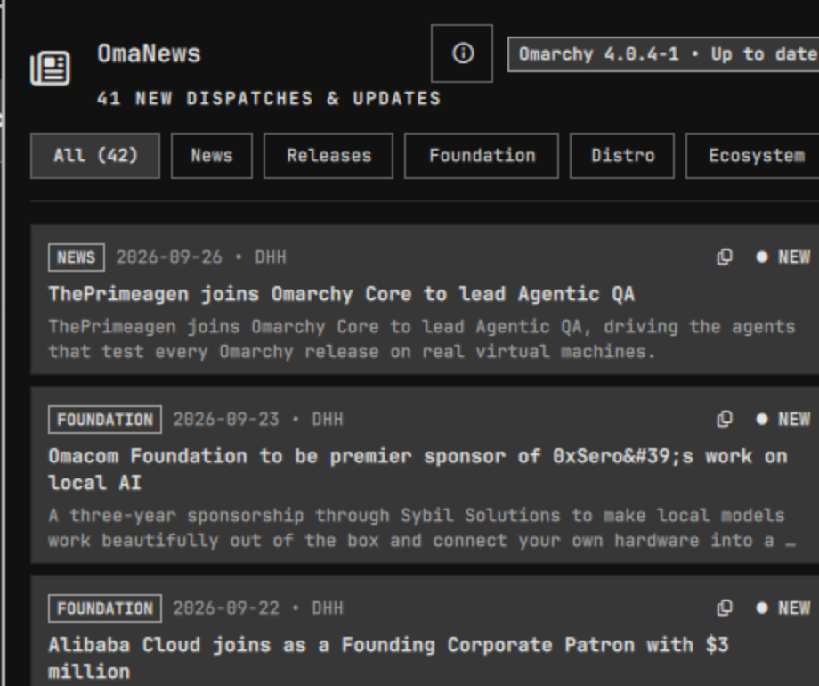

# OmaNews - Resmi Omarchy Linux Haber ve Dağıtım Bülten Merkezi

[](https://github.com/ozdil)
[](https://buymeacoffee.com/ozdil)



Omarchy Linux için resmi haber bültenleri, dağıtım sürüm duyuruları ve masaüstü bildirim merkezi.

Geliştirici: Ozan Özdil (ozdil)  
Lisans: MIT  
Eklenti Kimliği: ozdil.omacom-news  

---

## Özellikler

- Çoklu Akış Toplayıcı: Resmi Omarchy Haberleri (`omarchy.org/news/rss.xml`), GitHub dağıtım sürümleri (`omacom/omarchy/releases.atom`) ve yerel işletim sistemi paket sürüm kontrollerini (`pacman -Q omarchy`) birleştirir.
- Kategori Sınıflandırması: Sürüm (Release), Vakıf (Foundation), Dağıtım (Distro), Topluluk (Community) ve Ekosistem bültenleri için otomatik etiketleme.
- Yerel Rust Motoru: Omarchy Güvenlik Standartlarına (HANCORE / Sıfır Güven) tam uyumlu, bellek sınırları tanımlı alt süreç mimarisi.
- Masaüstü Bildirimleri: Yeni bültenler veya dağıtım sürümleri yayımlandığında yerel masaüstü uyarıları (`notify-send`).
- Gelişmiş Wayland Pano Entegrasyonu: Makale başlığındaki kopyalama butonu veya klavyeden `c` / `C` kısayolu ile bülten bağlantısını anında panoya (`wl-copy` / `xclip`) kopyalama ve arayüz içi Toast bildirimi.
- Yerel Quickshell Arayüzü: Kategori sekmeleri (Tümü, Haberler, Sürümler, Vakıf), canlı sistem sürüm rozeti ve harici tarayıcı açıcı.
- Çevrimdışı Dayanıklılık: Ağ bağlantısı olmadığında otomatik önbellek mekanizması ve güvenli yedek bülten akışı.

---

## Gereksinimler

- cargo ve rustc (Rust derleme zinciri)
- libnotify (notify-send üzerinden masaüstü bildirimleri için)
- pacman (yerel paket sürüm kontrolü için)
- wl-clipboard (Wayland ortamında pano kopyalama için) veya xclip (X11)

---

## Kurulum ve Derleme

```bash
# Eklenti dizinine gidin
cd ~/.config/omarchy/plugins/ozdil.omacom-news

# Motoru derleyin
cargo build --release

# İkiliyi kurun
cp target/release/omacomnews-engine ./omacomnews-engine
cp target/release/omacomnews-engine ~/.local/bin/omacomnews-engine
```

---

## Doğrulama ve Testler

```bash
# Birim testleri çalıştırın
cargo test

# Omarchy eklenti doğrulamasını çalıştırın
omarchy plugin validate .
```
